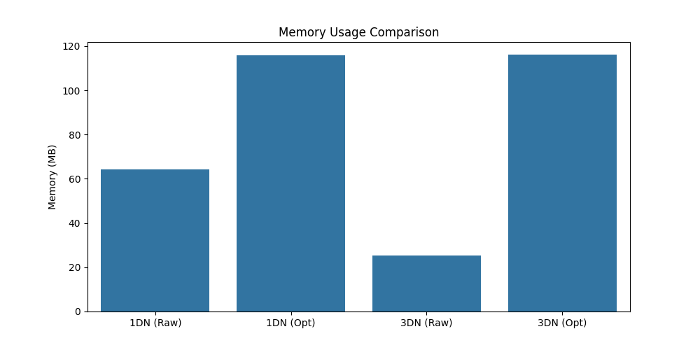

# Lab Work 2 - Hadoop
Анализ производительности Spark при разных конфигурациях Hadoop (1DN/3DN) с оптимизациями и без.

## Данные
В лабораторной работе используется датасет ["Crimes in Toronto"](https://www.kaggle.com/datasets/mohammadbadi/crimes-in-toronto) с Kaggle. Датасет содержит 420200 строк и 20+ признаков, из которых в работе задействованы 8. 

## Запуск
Для запуска можно воспользоваться файлом *run_experiments.sh*:
```
chmod +x run_experiments.sh
./run_experiments.sh
```
Все эксперименты будут проведены автоматически. Результаты сохраняются в папку *metrics*.

* Spark UI: http://localhost:8080
* Hadoop UI: http://localhost:9870

## Результаты
Используемые оптимизации: *repartition, cache*.

**Время:**

Как видно из графика, при использовании 3 нод скрипт отработал быстрее, чем с 1 нодой. Оптимизация дала заметный результат в эксперименте с 1 нодой, с 3 нодами время почти не изменилось.

**Память:**

Можно заметить, что оптимизация потребовала использования большего количества памяти, независимо от количества используемых нод. При этом без неё в экспериментах с 3 нодами было задействовано меньше памяти, чем с 1.