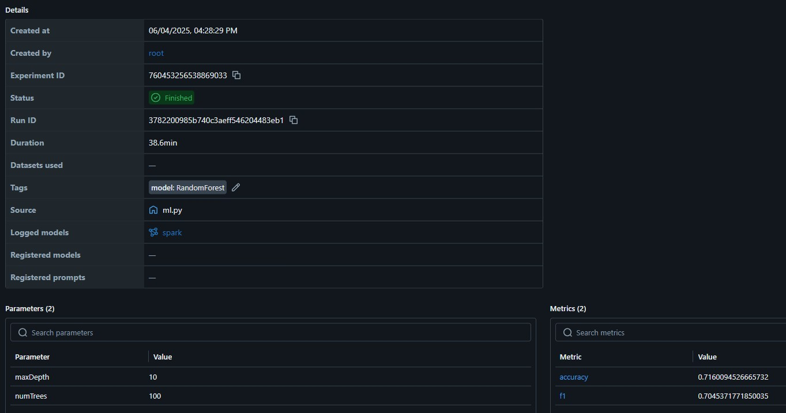
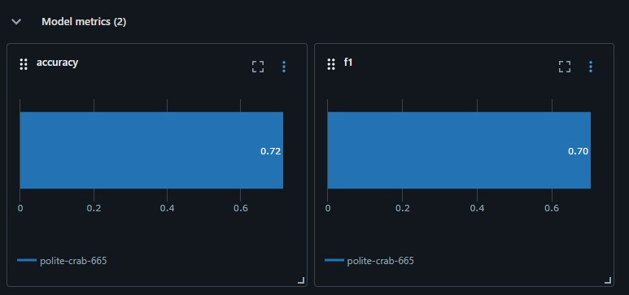

# Lab Work 3 - Delta Lake
Использование Lakehouse-архитектуры на базе Delta Lake и логирование экспериментов в MLflow.

## Данные
В работе используется валидационная выборка из датасета [Student Performance](https://www.kaggle.com/datasets/neuralsorcerer/student-performance?select=validation.csv).
- **Объём:** 999,229 записей (в загруженной версии оставлены первые 111,111 вхождений)
- **Признаки:** в работе используются 17 социодемографических характеристик учеников из 21.
- **Целевая переменная:** GPA (0.0-4.0, преобразован в 5 классов: 0, 1, 2, 3, 4)

## Архитектура решения
1. **Bronze Layer:** Исходные данные в Delta Lake
2. **Silver Layer:**
    - Очищенные данные
    - Feature Engineering (One-Hot Encoding, Standard Scaling)
    - Оптимизация (Z-Ordering)
3. **ML Pipeline:**
    - Обучение RandomForest с кросс-валидацией
    - Логирование параметров и метрик в MLflow

## Запуск
Запуск производится через файл *run.sh*

### Примечание
- В связи с ограничениями на размер загружаемых файлов в репозиторий загружена обрезанная часть датасета
- Из-за большого количества данных в полном датасете его обработка может занимать длительное время
- Эксперименты проводились на полном объёме данных

## Интерфейс
- Spark UI: http://localhost:4040
- MLflow UI: http://localhost:5001

#### Примеры:
**Интерфейс**

**Метрики**
